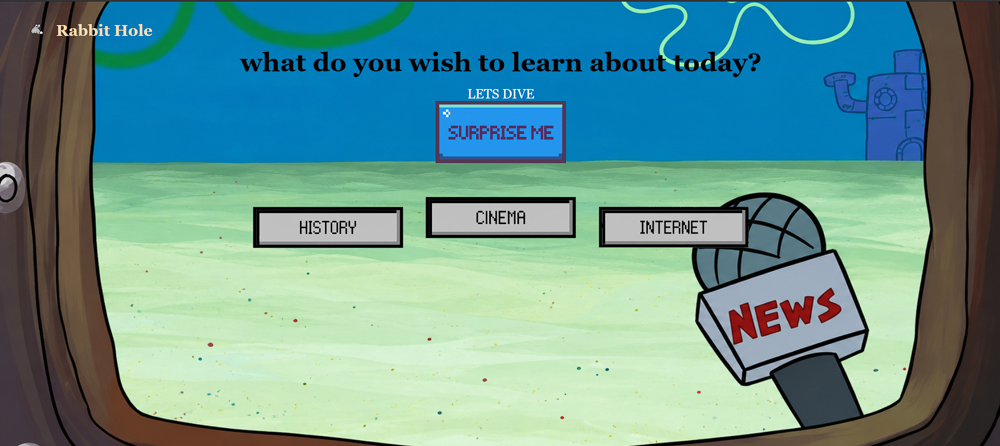
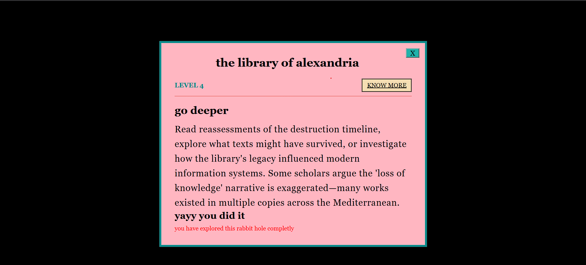

# rabbit hole

Heloz. **rabbit hole**  in a fun , interactive website where you can learn about some random things whiich would help you to larp in class that you have knowleddge in many fields .

I built this for pixl, Hack club

## Live website
try it yourself-
https://rabbitholeee.netlify.app/

## features

**pick a category** you can choose between history , cinema or internet .



**surprise me** if you are not sure what you wanna learn , just click the surprise me button and you'll get a good topic to start
**level progression** there are levels , so that you could know the different stages of that specific topic 
**know more** - if you want to learn more about a specific stage of a topic , just click on know more, you will find the resource for  that.



**exit hole** - press escape key to exit the hole .


## Getting Started

Follow these steps to run Rabbit Hole locally.

### 1. Clone the repository

```bash
git clone https://github.com/nAItiklearn/rabbit-hole.git
2. Navigate into the project
cd rabbit-hole
3. Run the project
```
You can simply open index.html in your browser.(no additional dependencies or installation req).

Alternatively, if you use VS Code, you can run the project using the Live Server extension:


### thanks for checking out my project!!
